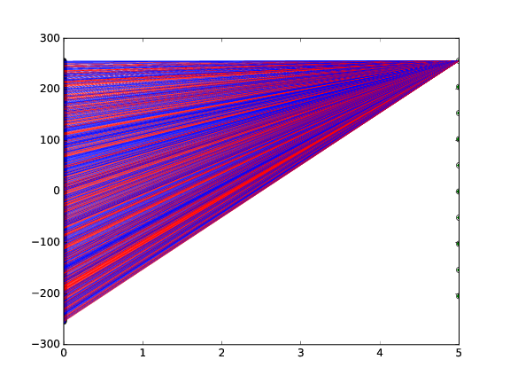
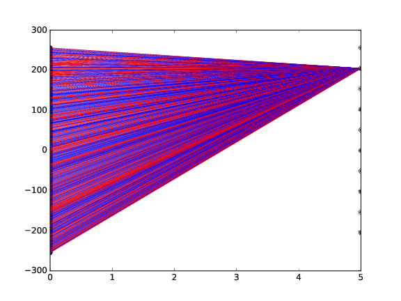
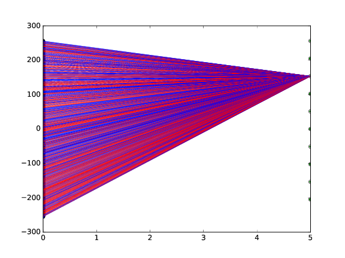
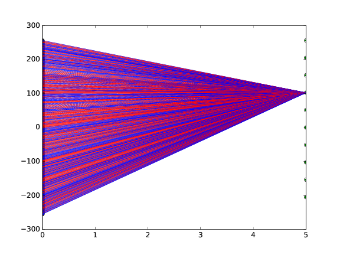
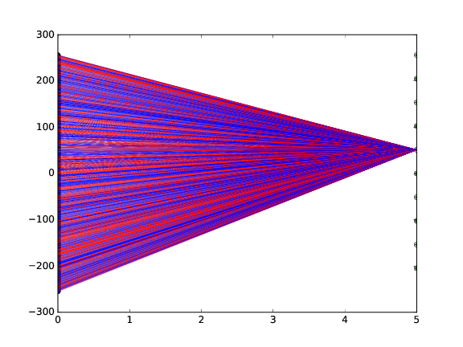
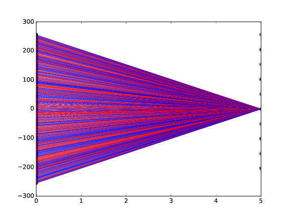
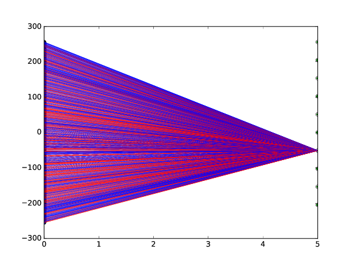
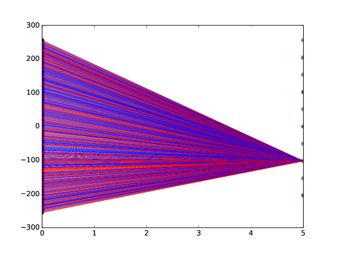
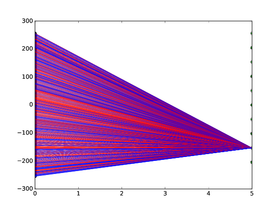
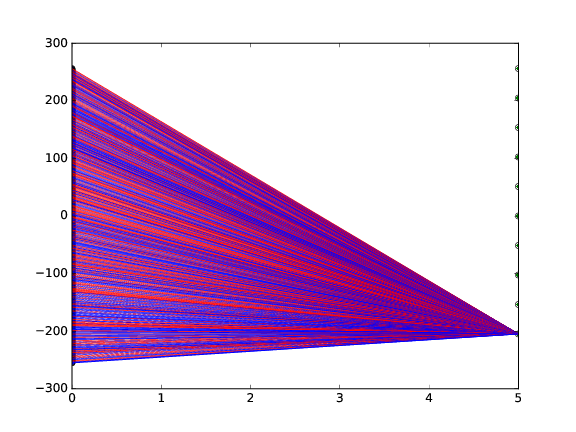

English

##Description
Visualize weight of Dense layer in keras.  
Positive and negative weights are drawn with red and blue lines respectively.  
Line width changes depending on the weight.

##Demo
The output of [kerasTrial/mnist](https://github.com/ryslil/kerasTrial/tree/master/mnist)

|weight0|weight1|
|:-:|:-:|
|||
|weight2|weight3|
|||
|weight4|weight5|
|||
|weight6|weight7|
|||
|weight8|weight9|
|||

##Usage
see [kerasTrial/mnist](https://github.com/ryslil/kerasTrial/tree/master/mnist)

日本語

##説明
kerasの全結合層(Dense layer)の重みを可視化します.
正負の重みはそれぞれ赤と青の線で描画されます.
重みが大きいほど線が太くなります.

##使い方
[kerasTrial/mnist](https://github.com/ryslil/kerasTrial/tree/master/mnist)を見てください.
